<!--
**jsxclan/jsxclan** is a ✨ _special_ ✨ repository because its `README.md` (this file) appears on your GitHub profile.

Here are some ideas to get you started:

- 🔭 I’m currently working on ...
- 🌱 I’m currently learning ...
- 👯 I’m looking to collaborate on ...
- 🤔 I’m looking for help with ...
- 💬 Ask me about ...
- 📫 How to reach me: ...
- 😄 Pronouns: ...
- ⚡ Fun fact: ...
-->

# **Note:** if you wanna contact me directly, please use [Telegram](https://t.me/jsxclan) to avoid late response, thank you

```txt
     @@@   @@@@@@   @@@  @@@      @@@@@@@  @@@        @@@@@@   @@@  @@@
     @@@  @@@@@@@   @@@  @@@     @@@@@@@@  @@@       @@@@@@@@  @@@@ @@@
     @@!  !@@       @@!  !@@     !@@       @@!       @@!  @@@  @@!@!@@@
     !@!  !@!       !@!  @!!     !@!       !@!       !@!  @!@  !@!!@!@!
     !!@  !!@@!!     !@@!@!      !@!       @!!       @!@!@!@!  @!@ !!@!
     !!!   !!@!!!     @!!!       !!!       !!!       !!!@!!!!  !@!  !!!
     !!:       !:!   !: :!!      :!!       !!:       !!:  !!!  !!:  !!!
!!:  :!:      !:!   :!:  !:!     :!:        :!:      :!:  !:!  :!:  !:!
::: : ::  :::: ::    ::  :::      ::: :::   :: ::::  ::   :::   ::   ::
 : :::    :: : :     :   ::       :: :: :  : :: : :   :   : :  ::    :
```

> ## Hi , I'm JSX Clan
>
> ### A passionate Full Stack JavaScript Developer


[](https://github.com/jsxclan)

- 🔭 I’m currently working on **[Musicont](https://github.com/jsxclan/musicont), [Guardmi](https://github.com/jsxclan/guardmi)**

- 🌱 I’m currently learning **[Bun.js](https://bun.sh)**, **[Three.js](https://threejs.org)**, **[GSAP](https://greensock.com)**

- 💬 Ask me about **JavaScript, Web3, Solidity, React, React Native, Expo, GraphQL, Node.js, Express.js, Capacitor.js, Ionic, Tailwind**

- 📫 How to reach me: **[jsxclan.dev@gmail.com](mailto:jsxclan.dev@gmail.com)**, **[Twitter](https://twitter.com/jsx_clan)**, **[Instagram](https://instagram.com/jsx.clan)**, **[Telegram](https://t.me/jsxclan)**

- ⚡ Fun fact: **Talk is cheap. Show me the code.**

### Three.js journey

Do you wish to learn Three.js, and create amazing 3d websites more like [Bruno Simon](https://bruno-simon.com) portfolio website.


If you do love to learn Three.js, kindly [start here](https://threejs-journey.xyz)

### Programming Languages & Tools

- [x] Used recently

<p align="left">
  <!-- Programming Langauges -->
  <a href="https://en.wikipedia.org/wiki/HTML5" target="_blank">
    
  </a>
  <a href="https://en.wikipedia.org/wiki/CSS" target="_blank">
    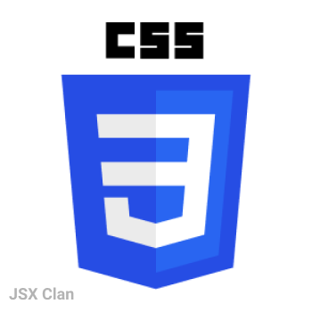
  </a>
  <a href="https://tailwindcss.com" target="_blank">
    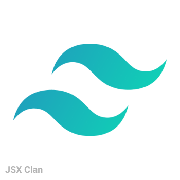
  </a>
  <a href="https://sass-lang.com" target="_blank">
    
  </a>
  <a href="https://www.javascript.com" target="_blank">
    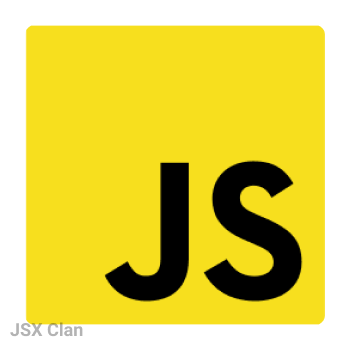
  </a>
  <a href="https://es6.io" target="_blank">
    
  </a>
  <a href="https://www.json.org" target="_blank">
    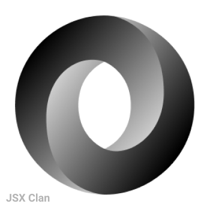
  </a>
  <a href="https://babeljs.io" target="_blank">
    
  </a>
  <a href="https://www.typescriptlang.org" target="_blank">
    
  </a>
  <a href="https://www.mysql.com" target="_blank">
    
  </a>
  <a href="https://soliditylang.org" target="_blank">
    
  </a>
  
  <!-- Frameworks and Libraries -->
  <a href="https://reactjs.org" target="_blank">
    
  </a>
  <a href="https://redux.js.org" target="_blank">
    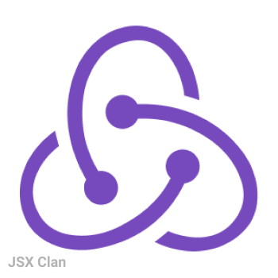
  </a>
  <a href="https://expo.dev" target="_blank">
    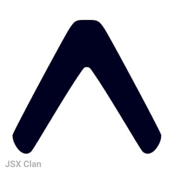
  </a>
  <a href="https://nodejs.org" target="_blank">
    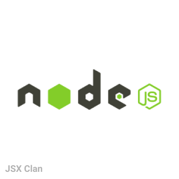
  </a>
  <a href="https://expressjs.com" target="_blank">
    
  </a>
  <a href="https://graphql.org" target="_blank">
    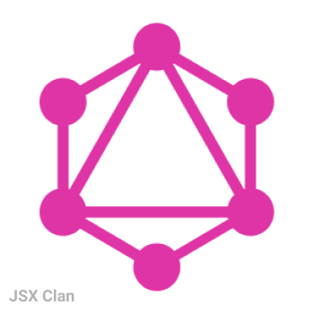
  </a>
  <a href="https://nextjs.org" target="_blank">
    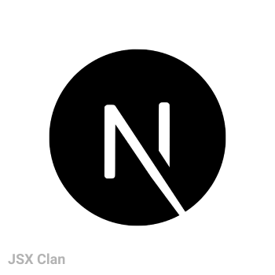
  </a>
  <a href="https://alpinejs.dev" target="_blank">
    
  </a>
  
  <!-- Service -->
  <a href="https://github.com" target="_blank">
    
  </a>
  <a href="https://www.postman.com" target="_blank">
    
  </a>
  <a href="https://www.heroku.com" target="_blank">
    
  </a>
  <a href="https://www.mongodb.com" target="_blank">
    
  </a>
  
  <!-- Design Tools -->
  <a href="https://www.figma.com" target="_blank">
    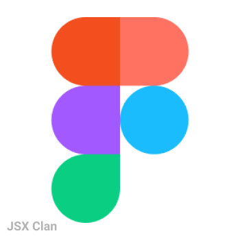
  </a>
  
  <!-- Package Managers -->
  <a href="https://www.npmjs.com" target="_blank">
    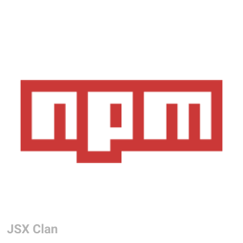
  </a>
  <a href="https://yarnpkg.com" target="_blank">
    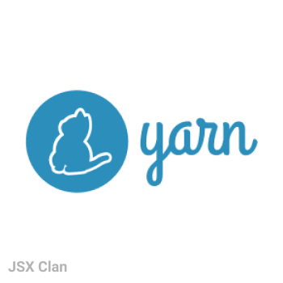
  </a>
  
  <!-- Others -->
  <a href="https://code.visualstudio.com" target="_blank">
    
  </a>
  <a href="https://git-scm.com" target="_blank">
    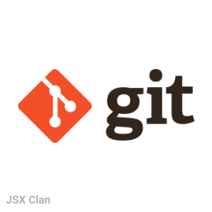
  </a>
</p>

- [ ] Used a long time ago

<p align="left">
  <!-- Programming Langauges -->
  <a href="https://getbootstrap.com" target="_blank">
    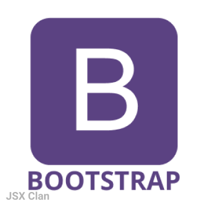
  </a>
  <a href="https://material-ui.com" target="_blank">
    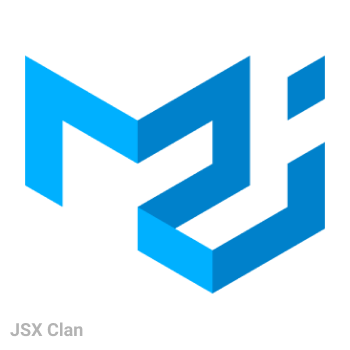
  </a>
  <a href="https://jquery.com" target="_blank">
    
  </a>
  <a href="https://en.wikipedia.org/wiki/Ajax_(programming)" target="_blank">
    
  </a>
  <a href="https://www.php.net" target="_blank">
    
  </a>
  
  <!-- Frameworks and Libraries -->
  <a href="https://www.gatsbyjs.com" target="_blank">
    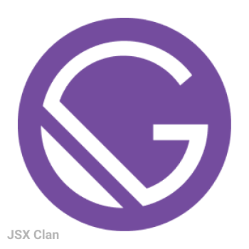
  </a>
  <a href="https://ionicframework.com" target="_blank">
    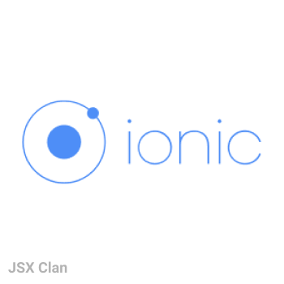
  </a>
  
  <!-- Service -->
  <a href="https://firebase.google.com" target="_blank">
    
  </a>
  <a href="https://www.netlify.com" target="_blank">
    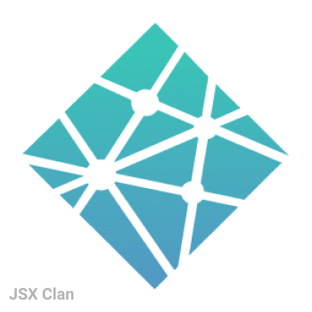
  </a>
  
  <!-- CMS -->
  <a href="https://wordpress.com" target="_blank">
    
  </a>
  <a href="https://www.shopify.com" target="_blank">
    
  </a>
  <a href="https://www.godaddy.com" target="_blank">
    
  </a>
  
  <!-- Design Tools -->
  <a href="https://www.photoshop.com" target="_blank">
    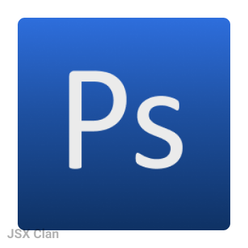
  </a>
</p>

### Sponsor, or Buy me a coffee

<p align="left">
  By buying me a coffee ☕, or sponsoring me ♥️, you can help me write bug fixes, documentation, improve existing features and add new ones. Who knows what I'll come up with next?
  
  <p>
    
  </p>
  
  [](https://patreon.com/jsxclan)
  [](https://www.buymeacoffee.com/jsxclan)
  
  Thanks in advance 
</p>

### Social media

[](https://dribbble.com/jsxclan)
[](https://twitter.com/jsx_clan)
[](https://instagram.com/jsx.clan)
[](https://facebook.com/JSX-Clan-103717625274089)

<!-- <p></p>

<p></p>

<p></p> -->


